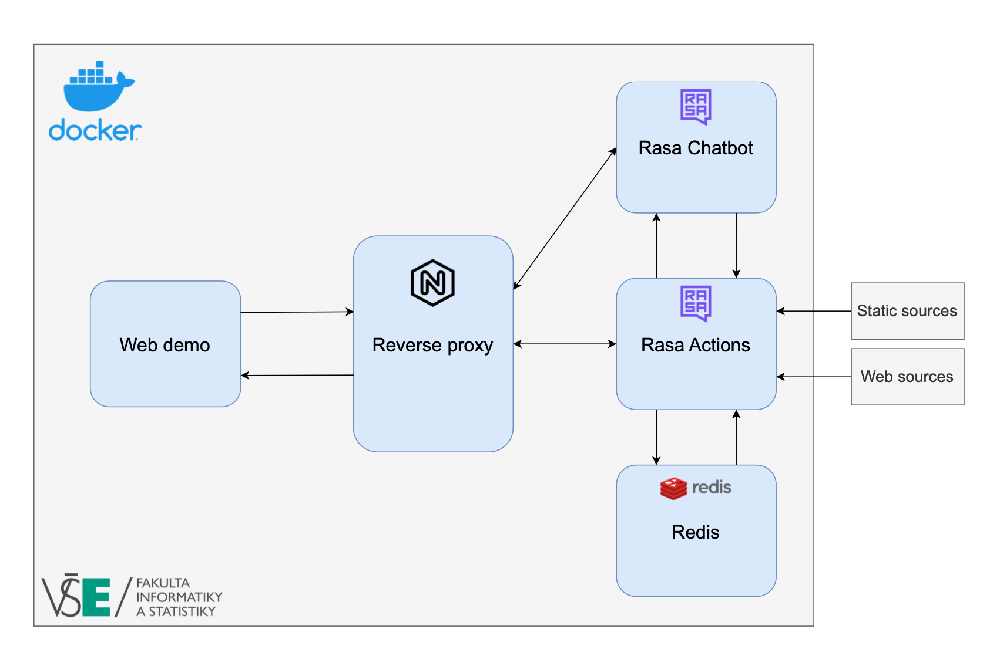

## Project Description
The aim of this project is to create the MVP of new chatbot for the Faculty of Informatics and Statistics, 
Prague University of Economics and Business. 

### High level architecture
The whole project is running in Docker containers. Please refer to the image below for the high-level architecture.

Components:
1. Rasa Chatbot - the core of chatbot, built using Rasa framework
2. Rasa Actions - the support component for chatbot, responsible for custom actions
3. Chatbot Redis - key-value in-memory DB, used to store scraped information
4. Nginx Server - used as reverse proxy for Chatbot and Actions server
5. Chatbot Web Demo - frontend component, taken from [existing repo](https://github.com/JiteshGaikwad/Chatbot-Widget) and modified



### Local development
You can spin up the containers by running following command in the root directory:
```bash
docker compose up --build
```
You should also create .env file with host IP variable (see .env.sample) as localhost.
Changes made on frontend side will be automatically propagated to the container.

Another option is to manually run Rasa Chatbot and Rasa Actions server components (following commands may be different on Windows OS):

*Note:* for this option you should also have running Redis instance (either Dockerized one, or the local installation) 

0. create venv for project and install required libraries
```bash
python3 -m venv venv
source venv/bin/activate
pip3 install -r requirements.txt
```

1. start Rasa actions server in chatbot folder
```bash
rasa run actions --cors "*" --debug
```
2. start Rasa server in chatbot folder
```bash
rasa run -m models --enable-api --cors "*" --debug
```
3. every time you make changes in chatbot, you should first train the model and then restart the server. 
```bash
rasa train
```

If you only made changes in actions, restarting actions server is enough.

### Deployment
Automatic deployment is made via simple CI/CD pipeline in GitHub Actions. To use this pipeline, several secrets should be set.
